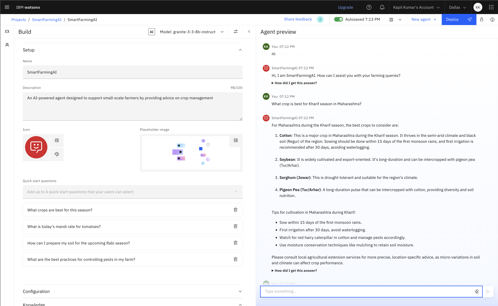
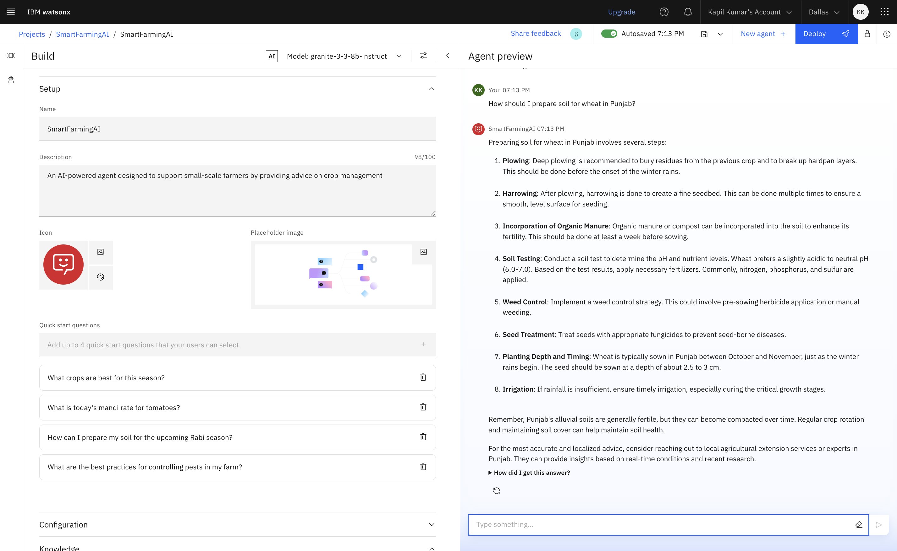
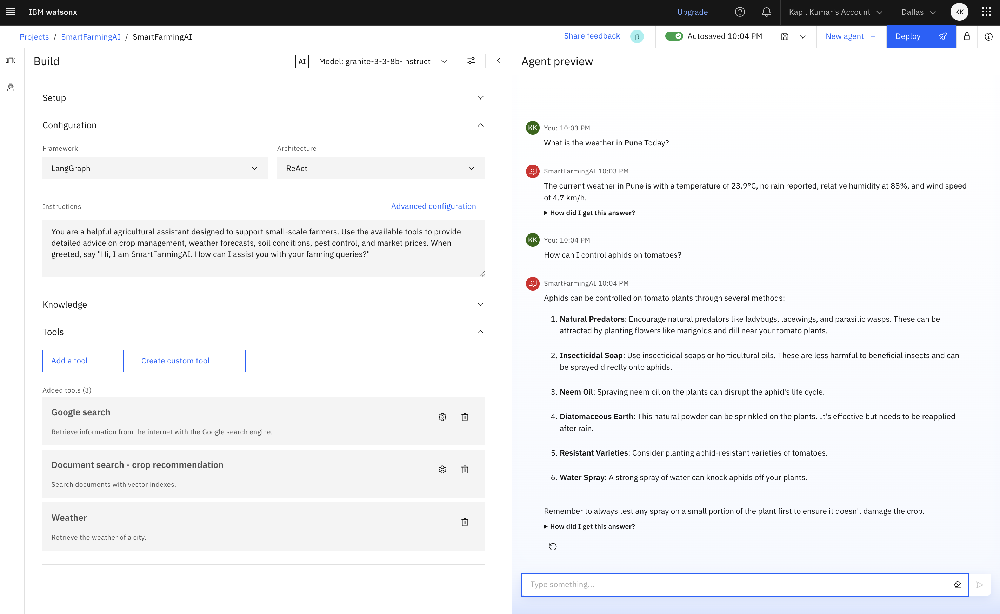
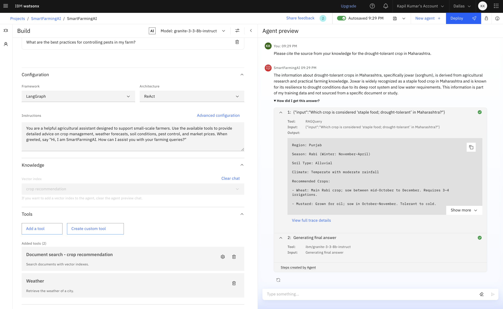
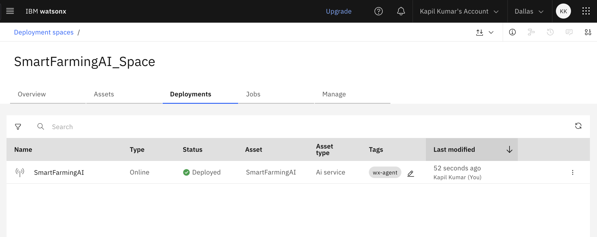

# Smart Farming AI Advisor  
**An AI agent for small-scale farmers using RAG and IBM Granite**

This project is developed as a capstone submission using IBM Cloud Agent Lab. The AI assistant supports small-scale farmers by providing real-time, localized advice on:

- Crop recommendations  
- Soil preparation  
- Pest control  
- Market price trends (simulated for this prototype)

It leverages Retrieval-Augmented Generation (RAG) and IBM Granite models, deployed via IBM Cloud Lite.

---

## Demo Screenshots

### 1. Agent Test – Crop Recommendation  
**Query:** What crop is best for Kharif season in Maharashtra?  
  
_The agent successfully recommends drought-tolerant crops like jowar based on the region and season._

---

### 2. Agent Test – Soil Preparation  
**Query:** How should I prepare soil for wheat in Punjab?  
  
_The AI provides relevant soil preparation tips for wheat in the Rabi season._

---

### 3. Weather Tool Integration  
**Query:** What is the weather in Pune today?  
  
_Real-time weather information is retrieved and used in the agent’s response._

---

### 4. Knowledge Base Retrieval  
**Query:** Please cite the source from your knowledge for the drought-tolerant crop in Maharashtra.  
  
_The agent correctly references the custom document (`Crop Recommendation.txt`) from the uploaded knowledge base._

---

### 5. Deployment Confirmation  
  
_Screenshot showing the successful deployment status in IBM Cloud Agent Lab._

---

## How It Works

1. The farmer inputs a query, such as: _"What crop is best for Kharif in Maharashtra?"_  
2. The AI agent retrieves relevant data from a custom knowledge base.  
3. It uses IBM Granite to generate a natural language response.  
4. The agent delivers concise, actionable advice in real time.

---

## Knowledge Base

The AI agent references curated agricultural data compiled from reliable sources, including:

- [ICAR – Indian Council of Agricultural Research](https://icar.org.in)  
- [Agmarknet – Agricultural Marketing](https://agmarknet.gov.in)  
- [KVKs – Krishi Vigyan Kendras](https://kvk.icar.gov.in)  
- [Soil Health Cards](https://soilhealth.dac.gov.in)

The knowledge files used in this agent can be found in the `/knowledge_base/` directory.

---

## Technology Stack

- IBM Cloud Lite (Free Tier)  
- IBM Agent Lab (Visual AI builder)  
- IBM watsonx.ai + IBM Granite models  
- RAG (Retrieval-Augmented Generation) architecture  
- Integrated tools: Document Search, Weather, and Google Search (as required)

---

## Capstone Project Submission

This project satisfies the objectives of the IBM Cloud Capstone Challenge titled:  
**"AI Agent for Smart Farming Advice, powered by RAG"**

Deliverables included:

- Use of IBM Cloud Lite services  
- IBM Granite model for generation  
- Realistic queries from farmers  
- Custom knowledge base with agricultural data  
- Working prototype tested in Agent Lab  
- Deployment and interaction trace

---

## Future Scope

Potential enhancements for real-world deployment include:

- Multilingual support (e.g., Hindi, Marathi, Tamil)  
- Integration of live APIs for real-time market prices  
- Development of a WhatsApp-based chatbot interface  
- Voice interaction for accessibility in low-literacy regions

---

## Special Thanks

This project was completed as part of an internship program.  
I would like to express my sincere gratitude to my mentors:

- **Narendra Eluri**  
- **Tarun Sharma**

for their invaluable guidance, support, and encouragement.
